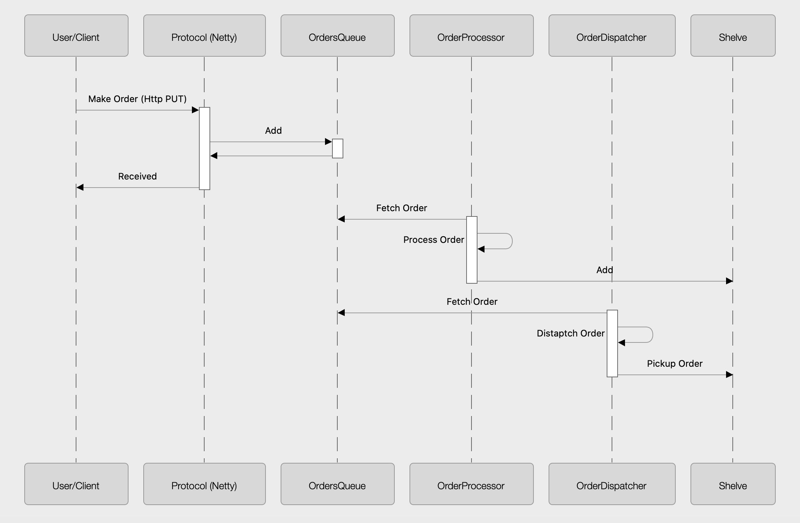

# Resturant Server

Simple Java/ Netty Order fullfilment Server 

## Prerequisites

1. java8 [setup](https://www.oracle.com/java/technologies/javase-jre8-downloads.html)
2. maven [setup](https://maven.apache.org/install.html)

## Packages

**Protocol**: Encapsulates all Netty details around receiving, encoding and decoding an order 

**Processor**: All the logic needed to process an order 

**courier**: All the logic needed to distatch an order 

**common**: A common classes between courier and processor 

## Build 

From Server folder run the following maven command: `mvn install`

## Running 

From Server folder run the following maven command: `mvn exec:java`

## Changing Log Level

Default log level is `INFO` 

To change the level  set `log4j.rootLogger=<Level>` in [log4j2.xml](./src/main/resources/log4j.properties)

You will need to rebuild the server : `mvn install`

Note: `DEBUG` level is very verbose so setting log level to `DEBUG` will have negative effet on performance.

## Changing Server Configuration

Configuration is based on Java Properties file [config.properties](./src/main/resources/config.properties)

All configration have default values, these values are specified at [ServerProperties.java](./src/main/java/common/ServerProperties.java) 

Example: 

`public static PropertyKey<Integer> PORT = new IntegerPropertyKey("port", 8080)`

`("port", 8080)`: 1st value is the key, 2nd is the default value so to override the PORT, just add in config.properties `port=1234`

## High Level Design 

My design is influenced by Producer/Consumer model and queues. Once the server receives an order request, it adds it to a queue and return immediately (This way Client Threads are not blocked). 

**Queue** 

In a real PROD implementation, we will be using a distributed queue (like Kafka) but for the scope of this excersice I created an interface `Queue` and a simple queue implementation using `BlockingDeque`. The idea behind usng `Queue` interface 

* Easly swap Queue implementation to a distributed queue (Kafka) when moving to PROD without changing the rest of the code

Something to highlight in here is that I am using two Queues for simplicity, one for Order Processing and one for Dispatcher Processing. These two queues can be easly one with using different topics on the same queue

**Consumer**

Once an order makes it to the queue, another set of threads (Consumers) are waiting to consumer form the queue. 

Two set of consumers (that runs in **Parallel**)

<u>Order Processor</u>: Process the order then one the order has been processed, it will be added to the right shelf following the set of rules specified in the exercise   

<u>Order Dispatcher</u>: Dispatch the order, wait and pickup the order once available 

This digaram will make it more clear 

## More Design details 

**ShelvesManager class** 

This is the main class responsible for managing the shelves which includes placing the orders on the right shelf using the roles specified in the exercise. For more details check [ShelvesManager](./src/main/java/common/ShelvesManager.java) 

**Expired Orders Garbage Collectors**

There is a spearate thread that runs on a configurable intervals and go through all the shelves and remove any expired orders. For more details check [ShelveOrderGarbageCollector](./src/main/java/common/ShelvesManager.java)

**Consumers Threads**

Number of consumers `OrderProcessor` or `Dispatcher` is configurable using property `numOfThreadsForOrderProcessing` & `numOfThreadsForDispatching` The default value is #of available processors. Check out [DispatcherManager](./src/main/java/courier/DispatcherManager.java) and [OrderProcessorManager](./src/main/java/processor/OrderProcessorManager.java) and [ServerProperties.java](./src/main/java/common/ServerProperties.java) 

